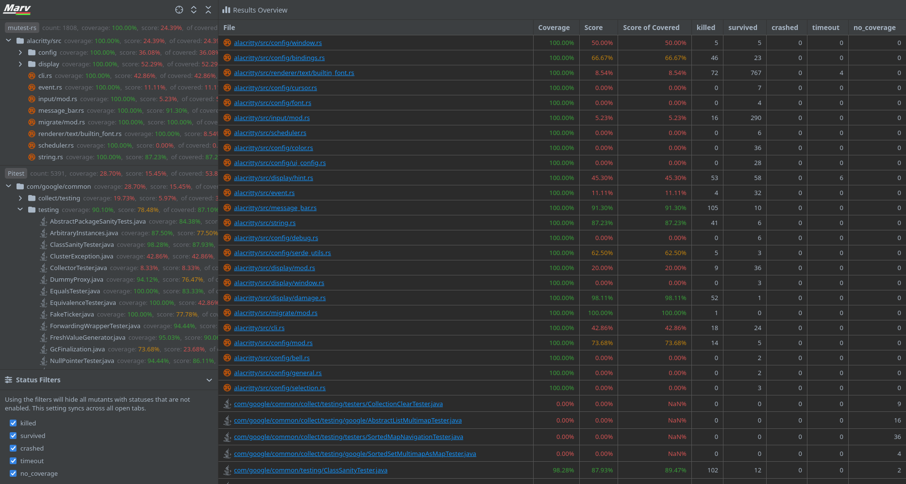
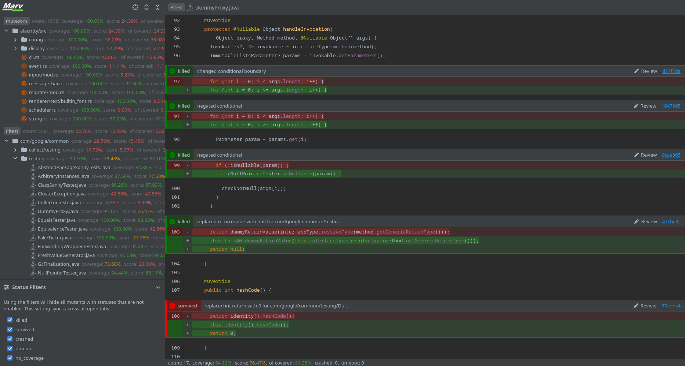
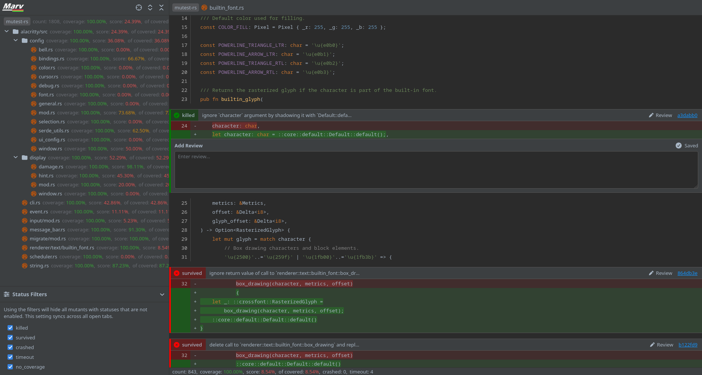
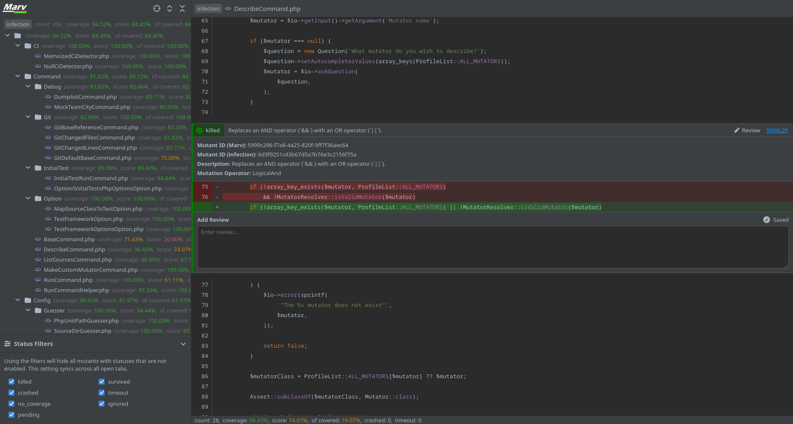

<p align="center">
  
</p>

<h2 align="center">Marv: Mutations Analysis, Review and Visualisation</h2>

Marv is a visualization and review tool for mutation testing. It provides a standardized results format and 
visualization across all [supported frameworks](#supported-frameworks).

Marv displays the results of multiple frameworks simultaneously, allowing for review of results across many frameworks
or even languages in one go.

## Table of Contents

* [Supported Frameworks](#supported-frameworks)
* [Installation](#installation)
  * [Build from source](#build-from-source)
  * [Libraries](#libraries)
* [Usage](#usage)
* [Gallery](#gallery)
* [Export Format](#export-format)
  * [Mutations Format](#mutations-format)
  * [Reviews Format](#reviews-format)
* [Other](#other)

## Supported Frameworks

A list of mutation testing frameworks that either are currently supported or will be supported in the future.

* 🏆 Supported out of the box
* ✅️ Supported with some configuration
* ⚠️ Experimental support
* 🚧 In development
* 🚫 Not currently supported

| Framework                                                                    | language   | Support | Marv Version | Notes                                                                                                                                                      |
|------------------------------------------------------------------------------|------------|:-------:|:------------:|------------------------------------------------------------------------------------------------------------------------------------------------------------|
| [Mull](https://mull-project.com/)                                            | C/C++      |   🏆    |    1.2.0     | Supported through [MTE](https://github.com/stryker-mutator/mutation-testing-elements) schema                                                               |
| [Dextool Mutate](https://joakim-brannstrom.github.io/dextool/plugin/mutate/) | C/C++      |   🚫    |              |                                                                                                                                                            |
| [stryker-net](https://github.com/stryker-mutator/stryker-net)                | C#         |   🏆    |    1.2.0     | Supported through [MTE](https://github.com/stryker-mutator/mutation-testing-elements) schema                                                               |
| [go-mutesting](https://github.com/zimmski/go-mutesting)                      | Go         |   🏆    |    1.2.1     |                                                                                                                                                            |
| [hcoles/pitest](https://github.com/hcoles/pitest)                            | Java       |   ✅️    |    1.0.0     | See [Pitest configuration](fws/pitest/README.md)                                                                                                           |
| [Major](https://mutation-testing.org/)                                       | Java       |   🚫    |              |                                                                                                                                                            |
| [stryker-js](https://github.com/stryker-mutator/stryker-js)                  | JavaScript |   🏆    |    1.2.0     | Supported through [MTE](https://github.com/stryker-mutator/mutation-testing-elements) schema                                                               |
| [mutaml](https://github.com/jmid/mutaml)                                     | OCaml      |   🚫    |              |                                                                                                                                                            |
| [infection](https://github.com/infection/infection)                          | PHP        |   🏆    |    1.2.0     | Supported through [MTE](https://github.com/stryker-mutator/mutation-testing-elements) schema, additionally see [infection readme](fws/infection/README.md) |
| [Cosmic Ray](https://github.com/sixty-north/cosmic-ray)                      | Python     |   🚫    |              |                                                                                                                                                            |
| [MutPy](https://github.com/mutpy/mutpy)                                      | Python     |   🚫    |              |                                                                                                                                                            |
| [mutant](https://github.com/mbj/mutant)                                      | Ruby       |   🚫    |              |                                                                                                                                                            |
| [mutest-rs](https://github.com/zalanlevai/mutest-rs)                         | Rust       |   🏆    |    1.0.0     |                                                                                                                                                            |
| [strkyer4s](https://github.com/stryker-mutator/stryker4s)                    | Scala      |   🏆    |    1.2.0     | Supported through [MTE](https://github.com/stryker-mutator/mutation-testing-elements) schema                                                               |

## Installation

Marv can be installed with the `go` tool. To use the installed executable, add the `GOPATH` environment variable 
to your system path. For more information run `go help install`.
```
go install github.com/SecretSheppy/marv/cmd/marv@latest
```

### Build from source

Builds exactly as a normal go project would. See the [go.dev](https://go.dev/doc/tutorial/compile-install) tutorial
for more information. The target file to build is [`cmd/marv/main.go`](cmd/marv/main.go).
```cli
go build cmd/marv/main.go -o [output]
```

### Libraries

If using a framework that requires external libraries, they will need to be set with the `MARV_LIB_PATH` environment
variable. The alternative to this is to put the library into the local directory where the Marv tool is being run.

## Usage

A simple guide of how to run Marv on a project for the first time. If at any point you need more information about
one of the Marv commands, try using the help command.
```cli
marv help [command]
```

1. The first step is to ensure that Marv is correctly installed. If the Marv executable is correctly installed, running
the Marv version command will output a version number. If an error is printed, then it likely means you need to add
the Marv executable install location to your system path.
```cli
marv --version
```

2. Run the list command to see a `list` of all the frameworks that your installed version of Marv supports.
```cli
marv list
```

3. Then navigate to your project location and run the Marv `init` command with the list of frameworks you are using
(Marv framework names are case-sensitive, so make sure to copy them correctly from the output of the `list` command).
This will create a `.marv.yml` file in the directory that Marv was run in. The file will contain the default Marv
configuration as well as a blank configuration for each framework that was listed.
```cli
marv init -f [framework] -f [framework] ...
```

4. Now fill in the configurations for each framework. Where frameworks require paths, using paths relative to a repository
will allow you to safely commit the `.marv.yml` file for others to use. When finished with the configurations, simply
run `marv`.
```cli
marv
```

5. If you have correctly configured the frameworks then that is it! Provided you keep the `.marv.yml` configuration
file then all you have to do in future is simply run `marv`.

## Gallery

Screenshots of the Marv user interface showing results from various frameworks.

|                                                                                                                                                                                                                          |                                                                                                                                                                                                   |
|--------------------------------------------------------------------------------------------------------------------------------------------------------------------------------------------------------------------------|---------------------------------------------------------------------------------------------------------------------------------------------------------------------------------------------------|
| **Marv Results Overview:** Showing results from [stryker-net](https://github.com/stryker-mutator/stryker-net) run on itself<br/>                                                      | **Marv Pitest Results:** Showing [hcoles/pitest](https://github.com/hcoles/pitest) mutants inline with a file from [guava](https://github.com/google/guava)<br/>   |
| **Marv mutest-rs Results:** Showing [mutest-rs](https://github.com/zalanlevai/mutest-rs) mutants inline with a file from [alacritty](https://github.com/alacritty/alacritty)<br/>  | **Marv Infection PHP Mutant:** Showing an isolated [Infection](https://github.com/infection/infection) mutant inline with a file from its own source<br/>  |

## Export Format

Marv exports both the mutations and reviews as a `.json` marshal of its internal mutations format for all frameworks. 
By using the `-m` or `--merge` flags, the results from all frameworks are merged into one large `.json` file.

### Mutations Format

The mutations format follows the internal structures defined in [`internal/mutations`](internal/mutations/mutations.go). 
The basic structure is `file path` > `conflict region` > `mutation`. Marv uses `conflict regions` or internally called 
`mutations.Conflict` to wrap all mutations that would conflict with each other if just rendered inline due to overlaps.

Any `ID` field is a UUID created by Marv. Where frameworks create mutant identifiers, they are stored against the mutant
as `FrameworkMutantID`.

```json
{
    "path/file.lang": [
        {
            "ID": "00000000-0000-0000-0000-000000000000",
            "StartLine": 94,
            "EndLine": 94,
            "Mutations": [
                {
                    "ID": "00000000-0000-0000-0000-000000000000",
                    "FrameworkMutantID": "",
                    "Description": "some description here",
                    "Operation": "some operator here",
                    "Start": {
                        "Line": 94,
                        "Char": 11
                    },
                    "End": {
                        "Line": 94,
                        "Char": 32
                    },
                    "Status": "SURVIVED",
                    "Replacement": "some.Replacement.String.Here()"
                }
            ]
        }
    ]
}
```

### Reviews Format

Reviews are exported against the corresponding mutations Marv Mutation ID and their Framework Mutation 
ID (if applicable). The review structure is defined in [`internal/review`](internal/review/review.go).

```json
[
    {
        "MutationID": "00000000-0000-0000-0000-000000000000",
        "FrameworkMutationID": "",
        "Framework": "mock-fw",
        "Review": "An example review"
    }
]
```

## Other

[Icon Licenses (icons.md)](icons.md)