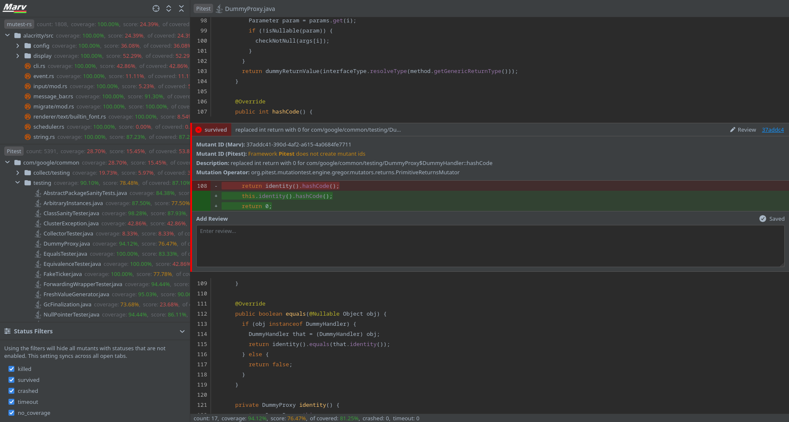

<p align="center">
  
</p>

<h2 align="center">Mutations Analysis, Review and Visualisation</h2>

Marv is a visualization and review tool for mutation testing. It provides a standardized results format and 
visualization across all [supported frameworks](#supported-frameworks).

Marv displays the results of multiple frameworks simultaneously, allowing for review of results across many frameworks
or even languages in one go.

## Table of Contents

* [Supported Frameworks](#supported-frameworks)
  * [Pitest Configuration](#pitest-configuration)
    * [Decompilers](#decompilers)
* [Install & Build](#install--build)
  * [Libraries](#libraries)
* [Usage](#usage)
* [Gallery](#gallery)
* [Export Format](#export-format)
  * [Mutations Format](#mutations-format)
  * [Reviews Format](#reviews-format)

## Supported Frameworks

A list of mutation testing frameworks that either are currently supported or will be supported in the future.

* 🏆 Supported out of the box
* ✅️ Supported with some configuration
* ⚠️ Experimental support
* 🚧 In development
* 🚫 Not currently supported

| Framework                                                                    | language   | Support | Marv Version | Required Libraries                                                                                                              | Notes                               |
|------------------------------------------------------------------------------|------------|:-------:|:------------:|---------------------------------------------------------------------------------------------------------------------------------|-------------------------------------|
| [Mull](https://mull-project.com/)                                            | C/C++      |   🚧    |              |                                                                                                                                 |                                     |
| [Dextool Mutate](https://joakim-brannstrom.github.io/dextool/plugin/mutate/) | C/C++      |   🚫    |              |                                                                                                                                 |                                     |
| [stryker-net](https://github.com/stryker-mutator/stryker-net)                | C#         |   🚫    |              |                                                                                                                                 |                                     |
| [hcoles/pitest](https://github.com/hcoles/pitest)                            | Java       |   ✅️    |    1.0.0     | [vineflower-server](https://github.com/SecretSheppy/vineflower-server) (recommended)<br/>or one of [alternatives](#decompilers) | See [Pitest configuration](#pitest) |
| [Major](https://mutation-testing.org/)                                       | Java       |   🚫    |              |                                                                                                                                 |                                     |
| [stryker-js](https://github.com/stryker-mutator/stryker-js)                  | JavaScript |   🚫    |              |                                                                                                                                 |                                     |
| [infection](https://github.com/infection/infection)                          | PHP        |   🚫    |              |                                                                                                                                 |                                     |
| [Cosmic Ray](https://github.com/sixty-north/cosmic-ray)                      | Python     |   🚫    |              |                                                                                                                                 |                                     |
| [MutPy](https://github.com/mutpy/mutpy)                                      | Python     |   🚫    |              |                                                                                                                                 |                                     |
| [mutant](https://github.com/mbj/mutant)                                      | Ruby       |   🚫    |              |                                                                                                                                 |                                     |
| [mutest-rs](https://github.com/zalanlevai/mutest-rs)                         | Rust       |   🏆    |    1.0.0     | Native                                                                                                                          |                                     |

### Pitest Configuration

Pitest must be run with the `-Dfeatures="+EXPORT"` flag which exports the mutated class files. This is required because
Marv will decompile these class files to construct each mutants replacement string.

> [!NOTE]
> The replacement strings (inserted lines) that Marv produces are correct, however they are occasionally flanked by
> incorrectly formatted deleted lines due to formatting differences between the source code and decompiled class code.

A new Marv Pitest configuration can be created by running the `marv init -f Pitest` command.

#### Decompilers

Marv has a range of decompiler options that can be used with to construct the Pitest mutant replacement strings. They
are listed below.

> [!CAUTION]
> The `garlic` decompiler is currently unstable and using it could cause some mutants to be skipped due to a
> segmentation fault that occurs when running `garlic` on some class files.

* [vineflower-server](https://github.com/SecretSheppy/vineflower-server) (recommended)
* [vineflower](https://github.com/Vineflower/vineflower)
* [garlic](https://github.com/neocanable/garlic)

For installation location see [Installation - Libraries](#libraries)

## Install & Build

Marv can be quickly and easily installed with the `go` tool:

```
go install github.com/SecretSheppy/marv/cmd/marv@latest
```

### Manual

Clone the repository and run the command below that relates to the host operating system. To run the `marv` executable
from anywhere on the system, add the compiled executable to the system `PATH` variable.

* **Linux/MacOS:** `go build cmd/marv/marv.go -o marv`
* **Windows:** `go build cmd/marv/marv.go -o marv.exe`

### Libraries

Libraries can either be stored directly in the Marv install directory in the `lib` folder (this will need to be created,
as it does not exist by default) or in an external folder provided to Marv via the `MARV_LIB_PATH` environment variable.

## Usage

The output from `marv --help` is featured below and details how marv can be used. Marv defaults to the port `:8080`.

```terminaloutput
Mutations Analysis, Review and Visualisation (Marv) is a tool that allows for efficient analysis and 
review of mutations through visualisations - it can be used 'as is' or can be integrated into a
third party application to streamline review processes

Usage:
  marv [flags]
  marv [command]

Available Commands:
  export      exports framework output into standardised JSON
  frameworks  lists all installed frameworks
  help        Help about any command
  init        initialises a new default marv.yml file

Flags:
  -c, --config string   .marv.yml file path
  -h, --help            help for marv
  -m, --merge           merges all frameworks output into one large json
  -o, --output string   specifies the output path
  -p, --port string     port to listen on
  -v, --version         version for marv
```

## Gallery

Screenshots of the Marv user interface showing results from:

* [mutest-rs](https://github.com/zalanlevai/mutest-rs) run on [alacritty](https://github.com/alacritty/alacritty)
* [hcoles/pitest](https://github.com/hcoles/pitest) run on [guava](https://github.com/google/guava)

|                                                                                                                                       |                                                                                                                                      |
|---------------------------------------------------------------------------------------------------------------------------------------|--------------------------------------------------------------------------------------------------------------------------------------|
| **Marv Results Overview:** Showing results from `mutest-rs` and `Pitest`<br/>                      | **Marv Pitest Results:** Showing `Pitest` mutants inline with a file from guava<br/>                  |
| **Marv mutest-rs Results:** Showing `mutest-rs` mutants inline with a file from alacritty<br/>  | **Marv Pitest Mutant:** Showing an isolated `Pitest` mutant inline with a file from guava<br/> |

## Export Format

Marv exports both the mutations and reviews as a `.json` marshal of its internal mutations format for all frameworks. 
By using the `-m` or `--merge` flags, the results from all frameworks are merged into one large `.json` file.

### Mutations Format

The mutations format follows the internal structures defined in [`internal/mutations`](internal/mutations). The basic
structure is `file path` > `conflict region` > `mutation`. Marv uses `conflict regions` or internally called 
`mutations.Conflict` to wrap all mutations that would conflict with each other if just rendered inline due to overlaps.

Any `ID` field is a UUID created by Marv. Where frameworks create mutant identifiers, they are stored against the mutant
as `FrameworkMutantID`.

```json
{
    "path/file.lang": [
        {
            "ID": "00000000-0000-0000-0000-000000000000",
            "StartLine": 94,
            "EndLine": 94,
            "Mutations": [
                {
                    "ID": "00000000-0000-0000-0000-000000000000",
                    "FrameworkMutantID": "",
                    "Description": "some description here",
                    "Operation": "some operator here",
                    "Start": {
                        "Line": 94,
                        "Char": 11
                    },
                    "End": {
                        "Line": 94,
                        "Char": 32
                    },
                    "Status": "SURVIVED",
                    "Replacement": "some.Replacement.String.Here()"
                }
            ]
        }
    ]
}
```

### Reviews Format

```json
[
    {
        "MutationID": "00000000-0000-0000-0000-000000000000",
        "FrameworkMutationID": "",
        "Framework": "mock-fw",
        "Review": "An example review"
    }
]
```