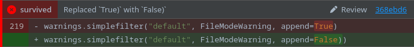

# Cosmic Ray

[Cosmic Ray](https://github.com/sixty-north/cosmic-ray) is a mutation testing framework for Python. It is supported by
all Marv versions `1.2.7+`.

## Contents

* [Getting Started With Cosmic Ray In Marv](#getting-started-with-cosmic-ray-in-marv)
* [Rare Formatting Errors](#rare-formatting-errors)

## Getting Started With Cosmic Ray In Marv

1. To get started with Cosmic Ray in Marv, run the `marv init` command to generate the required `.marv.yml`
   configuration file.

```terminaloutput
marv init -f cosmic-ray
```

2. Edit the fields under the `cosmic-ray` section in the `.marv.yml` file to point at the relevant locations.
   An example is shown below:

```yaml
# Enable the cosmic-ray framework
cosmic-ray:
    # The relative path the cosmic ray session sqlite database.
    sqlite-path: session-name.sqlite
    
    # The relative path to the working directory where cosmic ray was run.
    cr-work-dir: .
```

3. Run the `marv` command to launch Marv and click the localhost URL to open the Marv interface.

```terminaloutput
marv
```


## Rare Formatting Errors

As Cosmic Ray only specifies mutations location in the source code and not the actual source code mutation string, Marv
has to extract it from the provided diffs. In most cases this will work flawlessly; however, occasionally Cosmic Ray
will output an imperfect diff, an example of which is shown below.

```diff
--- mutation diff ---
--- asrc/requests/__init__.py
+++ bsrc/requests/__init__.py
@@ -216,5 +216,5 @@
 logging.getLogger(__name__).addHandler(NullHandler())
 
 # FileModeWarnings go off per the default.
-warnings.simplefilter("default", FileModeWarning, append=True)
-
+warnings.simplefilter("default", FileModeWarning, append=False)
+
```

**Caption:** Imperfect diff produced by Cosmic Ray. The second lines marked `-` and `+` are not actually changed,
and Cosmic Ray itself is only expecting one line to be mutated.

These imperfect diffs cause the Marv process that extracts the source code mutations to return slightly incorrect 
values. How this is reflected in the Marv interface is shown in the below screenshot.



**Caption:** Incorrect formatting in the Marv interface.

> [!IMPORTANT]
> When formatting errors occur it is still obvious what the mutation is, it is just good to be aware that formatting
errors may occur.
