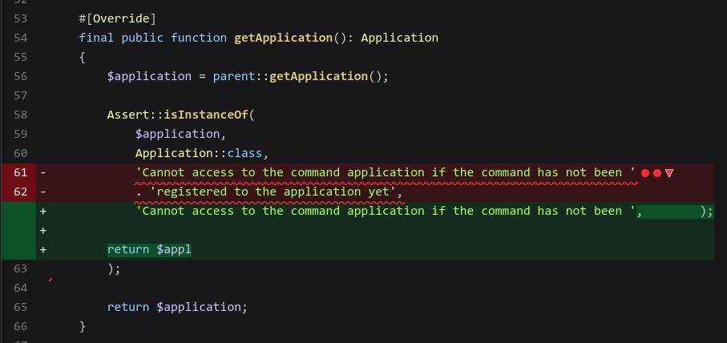
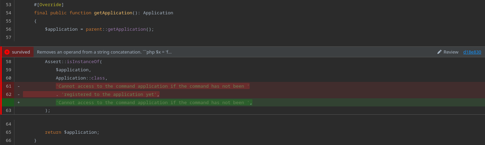

## Important Information About Infection Support in Marv

> [!NOTE]
> See [infection example MTE report](https://dashboard.stryker-mutator.io/reports/github.com/infection/infection/master#mutant) for the mutant dataset used to in examples.

The Infection framework often exports what Marv views as "broken" mutations. This is because the value of the
mutations end column exceeds the length of the end line, for example: 

```json
{
    "id": "adf6cacd35a4867054da054ee6a6b4a0",
    "mutatorName": "ConcatOperandRemoval",
    "replacement": "'Cannot access to the command application if the command has not been ',",
    "description": "Removes an operand from a string concatenation.\n\n```php\n$x = 'foo' . 'bar';\n```\n\nWill be mutated to:\n\n```php\n$x = 'foo';\n```\n\nAnd:\n\n```php\n$x = 'bar';\n",
    "location": {
        "start": {
            "line": 61,
            "column": 13
        },
        "end": {
            "line": 62,
            "column": 84
        }
    },
    "status": "Survived"
}
```

**Caption:** Mutant taken from [`Command/BaseCommand.php`](https://dashboard.stryker-mutator.io/reports/github.com/infection/infection/master#mutant/Command/BaseCommand.php) that Marv would view as "broken".

If Marv tries to render a "broken" mutation, like the one shown above, it will panic and fail to render the file. The 
reason this occurs in Marv and not in [Stryker Mutation Testing Elements (MTE)](https://github.com/stryker-mutator/mutation-testing-elements/tree/master) 
is because of the different ways the two system parse files. MTE never splits the source file into lines, and instead
makes indexes of where newline characters occur, and uses those to read and replace bits of the source. This means that
when a "broken" mutation is shown by MTE, it will not fail to render the file. However, it will render the mutation 
incorrectly, as shown below.



As previously stated, if Marv tried to render the above mutation as is, it would panic and fail to show the  file. This 
is because Marv does split the source file into a slice of lines, and then performs the replacement substitution on
the individual lines.

To correct for this issue with Infection, the [Marv Infection Framework](infection.go) instance will iterate over all
mutations, and for any mutations where `mutation.End.Char > len(line)`, it then sets `mutation.End.Char = len(line)`.
In practise, this seems to solve the formatting issues for most cases. The Marv formatted version of the same mutation
is shown below.

